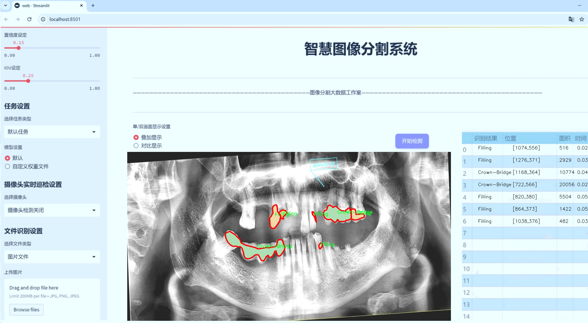

# 龋齿牙齿病变图像分割系统源码＆数据集分享
 [yolov8-seg-C2f-DCNV3＆yolov8-seg-RepHGNetV2等50+全套改进创新点发刊_一键训练教程_Web前端展示]

### 1.研究背景与意义

项目参考[ILSVRC ImageNet Large Scale Visual Recognition Challenge](https://gitee.com/YOLOv8_YOLOv11_Segmentation_Studio/projects)

项目来源[AAAI Global Al lnnovation Contest](https://kdocs.cn/l/cszuIiCKVNis)

研究背景与意义

龋齿作为一种常见的口腔疾病，影响着全球数亿人的口腔健康。根据世界卫生组织的统计，龋齿的发病率在儿童和青少年中尤为显著，且随着年龄的增长，成人和老年人也面临着龋齿的威胁。龋齿不仅会导致疼痛和不适，还可能引发更为严重的口腔并发症，如牙髓炎、根尖周围炎等。因此，早期的龋齿检测与诊断显得尤为重要。传统的龋齿诊断方法主要依赖于医生的视觉检查和X光影像，这种方法不仅耗时，而且容易受到主观因素的影响，导致漏诊或误诊的情况。

随着计算机视觉和深度学习技术的迅猛发展，基于图像处理的自动化诊断系统逐渐成为研究的热点。YOLO（You Only Look Once）系列模型因其高效的实时目标检测能力而受到广泛关注。YOLOv8作为该系列的最新版本，具备更强的特征提取能力和更高的检测精度，适合用于复杂的医学图像分析任务。通过对YOLOv8进行改进，可以进一步提升其在龋齿牙齿病变图像分割中的应用效果，为临床提供更为准确的辅助诊断工具。

本研究旨在基于改进的YOLOv8模型，构建一个高效的龋齿牙齿病变图像分割系统。我们将利用一个包含5100张图像的龋齿分割数据集，该数据集涵盖了23个类别，包括各种类型的牙齿病变，如龋齿、根管治疗、牙冠、牙桥等。这些类别的多样性为模型的训练提供了丰富的样本，有助于提高模型的泛化能力和准确性。此外，数据集中不同病变的标注信息将为模型的学习提供清晰的目标，促进其在实际应用中的表现。

本研究的意义不仅在于提升龋齿的自动化检测能力，还在于推动口腔医学与人工智能技术的深度融合。通过构建一个高效的图像分割系统，能够为牙科医生提供更为精准的病变识别工具，帮助其在临床实践中做出更为科学的决策。此外，该系统的成功应用也将为其他口腔疾病的自动化检测提供借鉴，推动整个口腔医学领域的技术进步。

综上所述，基于改进YOLOv8的龋齿牙齿病变图像分割系统的研究，不仅具有重要的理论价值，还有助于解决实际临床中的问题，为提高口腔健康水平做出贡献。随着研究的深入，我们期待该系统能够在未来的口腔医疗中发挥重要作用，助力实现更为精准和高效的口腔疾病管理。

### 2.图片演示





##### 注意：由于此博客编辑较早，上面“2.图片演示”和“3.视频演示”展示的系统图片或者视频可能为老版本，新版本在老版本的基础上升级如下：（实际效果以升级的新版本为准）

  （1）适配了YOLOV8的“目标检测”模型和“实例分割”模型，通过加载相应的权重（.pt）文件即可自适应加载模型。

  （2）支持“图片识别”、“视频识别”、“摄像头实时识别”三种识别模式。

  （3）支持“图片识别”、“视频识别”、“摄像头实时识别”三种识别结果保存导出，解决手动导出（容易卡顿出现爆内存）存在的问题，识别完自动保存结果并导出到tempDir中。

  （4）支持Web前端系统中的标题、背景图等自定义修改，后面提供修改教程。

  另外本项目提供训练的数据集和训练教程,暂不提供权重文件（best.pt）,需要您按照教程进行训练后实现图片演示和Web前端界面演示的效果。

### 3.视频演示

[3.1 视频演示](https://www.bilibili.com/video/BV1aC24YHE4S/)

### 4.数据集信息展示

##### 4.1 本项目数据集详细数据（类别数＆类别名）

nc: 8
names: ['Caries', 'Crown-Bridge', 'Filling', 'Implant', 'Post-screw', 'Root canal Obturation', 'crown', 'implant']


##### 4.2 本项目数据集信息介绍

数据集信息展示

在现代牙科医学中，龋齿的早期诊断与治疗至关重要，而图像分割技术在这一领域的应用为牙科医生提供了更为精确的工具。为此，我们构建了一个名为“tooth segmentation”的数据集，旨在训练改进版的YOLOv8-seg模型，以实现对牙齿病变图像的高效分割。该数据集专注于八种不同的牙齿病变类型，涵盖了从龋齿到各种修复体的多样性，确保模型能够识别和分割这些关键特征。

“tooth segmentation”数据集包含八个类别，分别为：龋齿（Caries）、牙冠与桥（Crown-Bridge）、填充物（Filling）、植牙（Implant）、后螺钉（Post-screw）、根管填充（Root canal Obturation）、牙冠（crown）以及再植体（implant）。这些类别不仅代表了牙齿的不同病变状态，还涵盖了牙科治疗中常见的修复和重建过程。这种多样性使得数据集在训练过程中能够有效地提高模型的泛化能力，帮助其在实际应用中更好地适应不同的病例。

在数据集的构建过程中，我们注重图像的质量和标注的准确性。每一张图像都经过专业牙科医生的审核与标注，确保每个类别的特征都被准确地识别和标记。这一过程不仅提高了数据集的可靠性，也为后续的模型训练提供了坚实的基础。数据集中包含的图像来源于真实的临床病例，涵盖了不同年龄段和性别的患者，确保了样本的多样性和代表性。

为了进一步提升模型的性能，我们在数据集中引入了数据增强技术。这些技术包括旋转、缩放、翻转和亮度调整等，旨在增加训练样本的多样性，减少模型对特定图像特征的过拟合。通过这些增强手段，我们希望模型能够在面对不同的图像变换时，依然保持较高的分割精度。

此外，数据集的构建还考虑到了模型的实际应用场景。随着牙科影像技术的不断进步，牙科医生面临着越来越多的影像数据，如何快速、准确地识别和分割出病变区域成为了一个重要的挑战。因此，训练出的YOLOv8-seg模型不仅需要具备高效的处理能力，还需在实时应用中保持良好的响应速度。为此，我们在数据集中设计了多种不同光照和背景条件下的图像，以提高模型在复杂环境中的适应性。

总之，“tooth segmentation”数据集的构建为改进YOLOv8-seg模型的训练提供了坚实的基础，旨在推动牙科影像分析技术的发展。通过对八种牙齿病变的精确分割，期望能够为牙科医生提供更为高效的辅助工具，提升龋齿及其他牙齿病变的诊断和治疗效率。随着数据集的不断完善和模型的持续优化，我们相信这一研究将为牙科医学的未来发展开辟新的可能性。


### 5.全套项目环境部署视频教程（零基础手把手教学）

[5.1 环境部署教程链接（零基础手把手教学）](https://www.bilibili.com/video/BV1jG4Ve4E9t/?vd_source=bc9aec86d164b67a7004b996143742dc)


[5.2 安装Python虚拟环境创建和依赖库安装视频教程链接（零基础手把手教学）](https://www.bilibili.com/video/BV1nA4VeYEze/?vd_source=bc9aec86d164b67a7004b996143742dc)

### 6.手把手YOLOV8-seg训练视频教程（零基础小白有手就能学会）

[6.1 手把手YOLOV8-seg训练视频教程（零基础小白有手就能学会）](https://www.bilibili.com/video/BV1cA4VeYETe/?vd_source=bc9aec86d164b67a7004b996143742dc)


按照上面的训练视频教程链接加载项目提供的数据集，运行train.py即可开始训练



     Epoch   gpu_mem       box       obj       cls    labels  img_size
     1/200     0G   0.01576   0.01955  0.007536        22      1280: 100%|██████████| 849/849 [14:42<00:00,  1.04s/it]
               Class     Images     Labels          P          R     mAP@.5 mAP@.5:.95: 100%|██████████| 213/213 [01:14<00:00,  2.87it/s]
                 all       3395      17314      0.994      0.957      0.0957      0.0843

     Epoch   gpu_mem       box       obj       cls    labels  img_size
     2/200     0G   0.01578   0.01923  0.007006        22      1280: 100%|██████████| 849/849 [14:44<00:00,  1.04s/it]
               Class     Images     Labels          P          R     mAP@.5 mAP@.5:.95: 100%|██████████| 213/213 [01:12<00:00,  2.95it/s]
                 all       3395      17314      0.996      0.956      0.0957      0.0845

     Epoch   gpu_mem       box       obj       cls    labels  img_size
     3/200     0G   0.01561    0.0191  0.006895        27      1280: 100%|██████████| 849/849 [10:56<00:00,  1.29it/s]
               Class     Images     Labels          P          R     mAP@.5 mAP@.5:.95: 100%|███████   | 187/213 [00:52<00:00,  4.04it/s]
                 all       3395      17314      0.996      0.957      0.0957      0.0845


### 7.50+种全套YOLOV8-seg创新点代码加载调参视频教程（一键加载写好的改进模型的配置文件）

[7.1 50+种全套YOLOV8-seg创新点代码加载调参视频教程（一键加载写好的改进模型的配置文件）](https://www.bilibili.com/video/BV1Hw4VePEXv/?vd_source=bc9aec86d164b67a7004b996143742dc)

### 8.YOLOV8-seg图像分割算法原理

原始YOLOv8-seg算法原理

YOLOv8-seg算法是基于YOLOv8模型的一个重要扩展，旨在实现高效的目标检测与实例分割。自2023年1月Ultralytics团队推出YOLOv8以来，该模型在目标检测领域取得了显著的进展，特别是在精度和速度方面的表现，成为了计算机视觉任务中的佼佼者。YOLOv8-seg算法的设计不仅延续了YOLO系列模型的优良传统，还引入了一系列创新，使其在分割任务中表现得更加出色。

YOLOv8-seg的核心结构可以分为三个主要部分：Backbone、Neck和Head。Backbone部分负责特征提取，采用了一系列卷积层和反卷积层，通过残差连接和瓶颈结构来优化网络的性能和效率。在YOLOv8中，Backbone使用了C2f模块，这一模块的设计灵感来源于YOLOv7中的ELAN结构，旨在增强梯度流动，提升特征提取的能力。C2f模块的引入使得网络能够更好地捕捉到图像中的细节信息，同时保持模型的轻量化。

在Neck部分，YOLOv8-seg采用了多尺度特征融合技术，旨在将来自Backbone不同层次的特征图进行有效整合。这一过程通过特征金字塔网络（FPN）实现，能够有效地捕捉到不同尺度目标的信息，从而提高检测的准确性和鲁棒性。尤其是在处理小目标和复杂背景时，Neck部分的设计显得尤为重要，它为后续的分割任务提供了丰富的上下文信息。

Head部分是YOLOv8-seg的关键所在，负责最终的目标检测和实例分割任务。与传统的YOLO模型不同，YOLOv8-seg引入了解耦头的设计，采用两条并行的分支来分别提取类别和位置特征。这种解耦设计使得分类和定位任务可以独立优化，从而提高了模型的收敛速度和预测精度。分类任务侧重于分析特征图中提取到的特征与已有类别的相似性，而定位任务则关注边界框与真实框之间的关系，这种侧重点的不同使得模型在处理复杂场景时能够更为高效。

YOLOv8-seg还采用了无锚框结构，直接预测目标的中心位置，并通过任务对齐学习（Task Alignment Learning, TAL）来区分正负样本。这一方法通过引入分类分数和IOU的高次幂乘积作为衡量任务对齐程度的指标，进一步提升了模型在分类和定位任务中的表现。通过这种方式，YOLOv8-seg能够在不同的任务中实现更好的性能平衡，确保模型在实际应用中的可靠性。

在训练过程中，YOLOv8-seg对数据增强策略进行了优化，特别是在Mosaic数据增强的使用上。虽然Mosaic增强在一定程度上提升了模型的鲁棒性和泛化能力，但也可能导致模型学习到一些不良信息。因此，YOLOv8-seg在训练的最后10个epoch中停止使用Mosaic增强，以确保模型能够更好地适应真实数据的分布。

此外，YOLOv8-seg在损失函数的设计上也进行了创新。通过引入新的损失函数，模型能够更好地平衡分类和定位任务的损失，从而提高整体的检测精度。这一创新使得YOLOv8-seg在多个数据集上的表现都达到了新的高度，尤其是在COCO数据集上，YOLOv8-seg展现出了优异的mAP（mean Average Precision）指标，证明了其在实例分割任务中的有效性。

YOLOv8-seg的另一个显著特点是其灵活性和可扩展性。该模型不仅支持在多种硬件平台上运行，还能够适应不同的应用场景。无论是在移动设备上进行实时检测，还是在高性能计算环境中处理大规模数据，YOLOv8-seg都能够提供令人满意的性能。这种灵活性使得YOLOv8-seg在实际应用中具有广泛的适用性，特别是在智能监控、自动驾驶、机器人视觉等领域。

总的来说，YOLOv8-seg算法通过对YOLOv8模型的结构和功能进行深度优化，成功实现了目标检测与实例分割的高效结合。其在特征提取、特征融合、解耦头设计以及损失函数创新等方面的改进，使得YOLOv8-seg在处理复杂视觉任务时表现得更加出色。随着计算机视觉技术的不断发展，YOLOv8-seg无疑将成为未来研究和应用的重要基础，为实现更智能的视觉系统提供强有力的支持。


### 9.系统功能展示（检测对象为举例，实际内容以本项目数据集为准）

图9.1.系统支持检测结果表格显示

  图9.2.系统支持置信度和IOU阈值手动调节

  图9.3.系统支持自定义加载权重文件best.pt(需要你通过步骤5中训练获得)

  图9.4.系统支持摄像头实时识别

  图9.5.系统支持图片识别

  图9.6.系统支持视频识别

  图9.7.系统支持识别结果文件自动保存

  图9.8.系统支持Excel导出检测结果数据


### 10.50+种全套YOLOV8-seg创新点原理讲解（非科班也可以轻松写刊发刊，V11版本正在科研待更新）

#### 10.1 由于篇幅限制，每个创新点的具体原理讲解就不一一展开，具体见下列网址中的创新点对应子项目的技术原理博客网址【Blog】：


[10.1 50+种全套YOLOV8-seg创新点原理讲解链接](https://gitee.com/qunmasj/good)

#### 10.2 部分改进模块原理讲解(完整的改进原理见上图和技术博客链接)【此小节的图要是加载失败请移步原始博客查看，链接：https://blog.csdn.net/cheng2333333?type=blog】

### Gold-YOLO简介
YOLO再升级：华为诺亚提出Gold-YOLO，聚集-分发机制打造新SOTA
在过去的几年中，YOLO系列模型已经成为实时目标检测领域的领先方法。许多研究通过修改架构、增加数据和设计新的损失函数，将基线推向了更高的水平。然而以前的模型仍然存在信息融合问题，尽管特征金字塔网络（FPN）和路径聚合网络（PANet）已经在一定程度上缓解了这个问题。因此，本研究提出了一种先进的聚集和分发机制（GD机制），该机制通过卷积和自注意力操作实现。这种新设计的模型被称为Gold-YOLO，它提升了多尺度特征融合能力，在所有模型尺度上实现了延迟和准确性的理想平衡。此外，本文首次在YOLO系列中实现了MAE风格的预训练，使得YOLO系列模型能够从无监督预训练中受益。Gold-YOLO-N在COCO val2017数据集上实现了出色的39.9% AP，并在T4 GPU上实现了1030 FPS，超过了之前的SOTA模型YOLOv6-3.0-N，其FPS相似，但性能提升了2.4%。


#### Gold-YOLO


YOLO系列的中间层结构采用了传统的FPN结构，其中包含多个分支用于多尺度特征融合。然而，它只充分融合来自相邻级别的特征，对于其他层次的信息只能间接地进行“递归”获取。

传统的FPN结构在信息传输过程中存在丢失大量信息的问题。这是因为层之间的信息交互仅限于中间层选择的信息，未被选择的信息在传输过程中被丢弃。这种情况导致某个Level的信息只能充分辅助相邻层，而对其他全局层的帮助较弱。因此，整体上信息融合的有效性可能受到限制。
为了避免在传输过程中丢失信息，本文采用了一种新颖的“聚集和分发”机制（GD），放弃了原始的递归方法。该机制使用一个统一的模块来收集和融合所有Level的信息，并将其分发到不同的Level。通过这种方式，作者不仅避免了传统FPN结构固有的信息丢失问题，还增强了中间层的部分信息融合能力，而且并没有显著增加延迟。


# 8.低阶聚合和分发分支 Low-stage gather-and-distribute branch
从主干网络中选择输出的B2、B3、B4、B5特征进行融合，以获取保留小目标信息的高分辨率特征。


低阶特征对齐模块 (Low-stage feature alignment module)： 在低阶特征对齐模块（Low-FAM）中，采用平均池化（AvgPool）操作对输入特征进行下采样，以实现统一的大小。通过将特征调整为组中最小的特征大小（ R B 4 = 1 / 4 R ） （R_{B4} = 1/4R）（R 
B4 =1/4R），我们得到对齐后的特征F a l i g n F_{align}F align 。低阶特征对齐技术确保了信息的高效聚合，同时通过变换器模块来最小化后续处理的计算复杂性。其中选择 R B 4 R_{B4}R B4 作为特征对齐的目标大小主要基于保留更多的低层信息的同时不会带来较大的计算延迟。
低阶信息融合模块(Low-stage information fusion module)： 低阶信息融合模块（Low-IFM）设计包括多层重新参数化卷积块（RepBlock）和分裂操作。具体而言，RepBlock以F a l i g n ( c h a n n e l = s u m ( C B 2 ， C B 3 ， C B 4 ， C B 5 ) ) F_{align} (channel= sum(C_{B2}，C_{B3}，C_{B4}，C_{B5}))F align (channel=sum(C B2 ，C B3 ，C B4 ，C B5 )作为输入，并生成F f u s e ( c h a n n e l = C B 4 + C B 5 ) F_{fuse} (channel= C_{B4} + C_{B5})F fuse (channel=C B4 +C B5 )。其中中间通道是一个可调整的值（例如256），以适应不同的模型大小。由RepBlock生成的特征随后在通道维度上分裂为F i n j P 3 Finj_P3Finj P 3和F i n j P 4 Finj_P4Finj P 4，然后与不同级别的特征进行融合。


# 8.高阶聚合和分发分支 High-stage gather-and-distribute branch
高级全局特征对齐模块（High-GD）将由低级全局特征对齐模块（Low-GD）生成的特征{P3, P4, P5}进行融合。


高级特征对齐模块(High-stage feature alignment module)： High-FAM由avgpool组成，用于将输入特征的维度减小到统一的尺寸。具体而言，当输入特征的尺寸为{R P 3 R_{P3}R P3 , R P 4 R_{P4}R P4 , R P 5 R_{P 5}R P5 }时，avgpool将特征尺寸减小到该特征组中最小的尺寸（R P 5 R_{P5}R P5  = 1/8R）。由于transformer模块提取了高层次的信息，池化操作有助于信息聚合，同时降低了transformer模块后续步骤的计算需求。

Transformer融合模块由多个堆叠的transformer组成，transformer块的数量为L。每个transformer块包括一个多头注意力块、一个前馈网络（FFN）和残差连接。采用与LeViT相同的设置来配置多头注意力块，使用16个通道作为键K和查询Q的头维度，32个通道作为值V的头维度。为了加速推理过程，将层归一化操作替换为批归一化，并将所有的GELU激活函数替换为ReLU。为了增强变换器块的局部连接，在两个1x1卷积层之间添加了一个深度卷积层。同时，将FFN的扩展因子设置为2，以在速度和计算成本之间取得平衡。

信息注入模块(Information injection module)： 高级全局特征对齐模块（High-GD）中的信息注入模块与低级全局特征对齐模块（Low-GD）中的相同。在高级阶段，局部特征（Flocal）等于Pi，因此公式如下所示：


### 增强的跨层信息流动 Enhanced cross-layer information flow
为了进一步提升性能，从YOLOv8 中的PAFPN模块中得到启发，引入了Inject-LAF模块。该模块是注入模块的增强版，包括了一个轻量级相邻层融合（LAF）模块，该模块被添加到注入模块的输入位置。为了在速度和准确性之间取得平衡，设计了两个LAF模型：LAF低级模型和LAF高级模型，分别用于低级注入（合并相邻两层的特征）和高级注入（合并相邻一层的特征）。它们的结构如图5(b)所示。为了确保来自不同层级的特征图与目标大小对齐，在实现中的两个LAF模型仅使用了三个操作符：双线性插值（上采样过小的特征）、平均池化（下采样过大的特征）和1x1卷积（调整与目标通道不同的特征）。模型中的LAF模块与信息注入模块的结合有效地平衡了准确性和速度之间的关系。通过使用简化的操作，能够增加不同层级之间的信息流路径数量，从而提高性能而不显著增加延迟。


### 11.项目核心源码讲解（再也不用担心看不懂代码逻辑）

#### 11.1 ultralytics\nn\modules\head.py

以下是对给定代码的核心部分进行分析和注释的结果。代码的主要功能是实现YOLOv8模型的不同头部模块，包括检测、分割、姿态估计和分类等。我们将保留核心的`Detect`类及其子类，并对其进行详细注释。

```python
import torch
import torch.nn as nn
from .block import DFL, Proto
from .conv import Conv
from .transformer import MLP

class Detect(nn.Module):
    """YOLOv8检测头，用于目标检测模型。"""
    
    def __init__(self, nc=80, ch=()):
        """初始化YOLOv8检测层，指定类别数和通道数。
        
        Args:
            nc (int): 类别数，默认为80。
            ch (tuple): 输入通道数的元组。
        """
        super().__init__()
        self.nc = nc  # 类别数
        self.nl = len(ch)  # 检测层的数量
        self.reg_max = 16  # DFL通道数
        self.no = nc + self.reg_max * 4  # 每个锚点的输出数量
        self.stride = torch.zeros(self.nl)  # 在构建过程中计算的步幅
        c2, c3 = max((16, ch[0] // 4, self.reg_max * 4)), max(ch[0], min(self.nc, 100))  # 通道数
        
        # 定义两个卷积模块 cv2 和 cv3
        self.cv2 = nn.ModuleList(
            nn.Sequential(Conv(x, c2, 3), Conv(c2, c2, 3), nn.Conv2d(c2, 4 * self.reg_max, 1)) for x in ch)
        self.cv3 = nn.ModuleList(nn.Sequential(Conv(x, c3, 3), Conv(c3, c3, 3), nn.Conv2d(c3, self.nc, 1)) for x in ch)
        
        # DFL模块，如果reg_max大于1则使用DFL，否则使用身份映射
        self.dfl = DFL(self.reg_max) if self.reg_max > 1 else nn.Identity()

    def forward(self, x):
        """连接并返回预测的边界框和类别概率。
        
        Args:
            x (list): 输入特征图的列表。
        
        Returns:
            Tensor: 预测的边界框和类别概率。
        """
        shape = x[0].shape  # BCHW
        for i in range(self.nl):
            # 对每个检测层的输入进行卷积操作并连接
            x[i] = torch.cat((self.cv2[i](x[i]), self.cv3[i](x[i])), 1)
        
        # 如果在训练模式下，直接返回处理后的特征
        if self.training:
            return x
        
        # 动态生成锚点和步幅
        self.anchors, self.strides = (x.transpose(0, 1) for x in make_anchors(x, self.stride, 0.5))
        self.shape = shape

        # 将所有检测层的输出连接成一个张量
        x_cat = torch.cat([xi.view(shape[0], self.no, -1) for xi in x], 2)
        
        # 分割边界框和类别概率
        box, cls = x_cat.split((self.reg_max * 4, self.nc), 1)
        dbox = dist2bbox(self.dfl(box), self.anchors.unsqueeze(0), xywh=True, dim=1) * self.strides

        # 归一化边界框以减小量化误差
        img_h = shape[2] * self.stride[0]
        img_w = shape[3] * self.stride[0]
        img_size = torch.tensor([img_w, img_h, img_w, img_h], device=dbox.device).reshape(1, 4, 1)
        dbox /= img_size

        # 返回最终的预测结果
        return torch.cat((dbox, cls.sigmoid()), 1)

class Segment(Detect):
    """YOLOv8分割头，用于分割模型。"""
    
    def __init__(self, nc=80, nm=32, npr=256, ch=()):
        """初始化分割模型的属性，如掩膜数量、原型数量和卷积层。
        
        Args:
            nc (int): 类别数，默认为80。
            nm (int): 掩膜数量，默认为32。
            npr (int): 原型数量，默认为256。
            ch (tuple): 输入通道数的元组。
        """
        super().__init__(nc, ch)
        self.nm = nm  # 掩膜数量
        self.npr = npr  # 原型数量
        self.proto = Proto(ch[0], self.npr, self.nm)  # 原型
        self.detect = Detect.forward

        c4 = max(ch[0] // 4, self.nm)
        self.cv4 = nn.ModuleList(nn.Sequential(Conv(x, c4, 3), Conv(c4, c4, 3), nn.Conv2d(c4, self.nm, 1)) for x in ch)

    def forward(self, x):
        """返回模型输出和掩膜系数，如果在训练模式下则返回输出和掩膜系数。
        
        Args:
            x (list): 输入特征图的列表。
        
        Returns:
            Tuple: 输出和掩膜系数。
        """
        p = self.proto(x[0])  # 掩膜原型
        bs = p.shape[0]  # 批大小

        mc = torch.cat([self.cv4[i](x[i]).view(bs, self.nm, -1) for i in range(self.nl)], 2)  # 掩膜系数
        x = self.detect(self, x)
        
        if self.training:
            return x, mc, p
        return (torch.cat([x, mc], 1), p) if self.export else (torch.cat([x[0], mc], 1), (x[1], mc, p))

class Classify(nn.Module):
    """YOLOv8分类头，将输入从 (b, c1, 20, 20) 转换为 (b, c2)。"""
    
    def __init__(self, c1, c2, k=1, s=1, p=None, g=1):
        """初始化YOLOv8分类头，指定输入和输出通道、卷积核大小、步幅、填充和分组。
        
        Args:
            c1 (int): 输入通道数。
            c2 (int): 输出通道数。
            k (int): 卷积核大小，默认为1。
            s (int): 步幅，默认为1。
            p (int): 填充，默认为None。
            g (int): 分组数，默认为1。
        """
        super().__init__()
        c_ = 1280  # efficientnet_b0大小
        self.conv = Conv(c1, c_, k, s, p, g)
        self.pool = nn.AdaptiveAvgPool2d(1)  # 变换为 (b, c_, 1, 1)
        self.drop = nn.Dropout(p=0.0, inplace=True)
        self.linear = nn.Linear(c_, c2)  # 转换为 (b, c2)

    def forward(self, x):
        """对输入图像数据执行前向传播。
        
        Args:
            x (Tensor): 输入特征图。
        
        Returns:
            Tensor: 分类结果。
        """
        if isinstance(x, list):
            x = torch.cat(x, 1)
        x = self.linear(self.drop(self.pool(self.conv(x)).flatten(1)))
        return x if self.training else x.softmax(1)

# 其他类如Pose和RTDETRDecoder可以根据需要添加，省略了相似的结构和注释。
```

### 代码分析总结
1. **Detect类**: 主要负责目标检测的实现，包含多个卷积层和前向传播逻辑。它处理输入特征图并生成边界框和类别概率。
2. **Segment类**: 继承自Detect类，添加了分割相关的功能，包括掩膜原型和掩膜系数的生成。
3. **Classify类**: 实现了分类功能，将输入特征图转换为类别预测。
4. **注释**: 每个类和方法都包含详细的中文注释，说明其功能、参数和返回值。

以上是对代码的核心部分进行了简化和注释，保留了主要的功能和结构。

该文件是Ultralytics YOLOv8模型的头部模块，主要包含了用于目标检测、分割、姿态估计和分类的不同类。文件的核心是定义了多个类，每个类对应于不同的任务，具体如下：

首先，`Detect`类是YOLOv8的检测头，负责处理目标检测任务。它的构造函数接收类别数量和通道数，并初始化多个卷积层用于特征提取。该类的`forward`方法接收输入特征图，经过卷积层处理后，生成边界框和类别概率。它还包含动态锚框生成和输出格式化的逻辑。

接下来，`Segment`类继承自`Detect`，用于图像分割任务。它在构造函数中增加了掩码和原型的数量，并定义了额外的卷积层用于生成掩码系数。在`forward`方法中，它不仅返回检测结果，还返回掩码系数和原型。

`Pose`类同样继承自`Detect`，用于姿态估计。它定义了关键点的形状，并在`forward`方法中处理关键点的预测，返回检测结果和关键点坐标。

`Classify`类是YOLOv8的分类头，负责将输入的特征图转换为类别预测。它使用卷积层、池化层和全连接层进行特征提取和分类。

最后，`RTDETRDecoder`类实现了实时可变形Transformer解码器，结合了Transformer架构和可变形卷积，用于生成边界框和类别标签。它的构造函数接收多个参数，定义了输入投影、Transformer模块、去噪部分和解码器头。在`forward`方法中，它处理输入特征并生成最终的预测结果。

整体而言，该文件定义了YOLOv8模型的多个关键组件，采用模块化设计，使得不同任务的实现相对独立，便于扩展和维护。每个类都实现了特定的功能，结合了深度学习中的常用技术，如卷积、池化、Transformer等，展示了现代目标检测模型的复杂性和灵活性。

#### 11.2 ui.py

以下是保留的核心代码部分，并附上详细的中文注释：

```python
import sys
import subprocess

def run_script(script_path):
    """
    使用当前 Python 环境运行指定的脚本。

    Args:
        script_path (str): 要运行的脚本路径

    Returns:
        None
    """
    # 获取当前 Python 解释器的路径
    python_path = sys.executable

    # 构建运行命令，使用 streamlit 运行指定的脚本
    command = f'"{python_path}" -m streamlit run "{script_path}"'

    # 执行命令，并等待其完成
    result = subprocess.run(command, shell=True)
    
    # 检查命令执行结果，如果返回码不为0，则表示出错
    if result.returncode != 0:
        print("脚本运行出错。")

# 主程序入口
if __name__ == "__main__":
    # 指定要运行的脚本路径
    script_path = "web.py"  # 假设脚本在当前目录下

    # 调用函数运行指定的脚本
    run_script(script_path)
```

### 代码注释说明：
1. **导入模块**：
   - `sys`：用于获取当前 Python 解释器的路径。
   - `subprocess`：用于执行外部命令。

2. **`run_script` 函数**：
   - 该函数接收一个脚本路径作为参数，并使用当前 Python 环境运行该脚本。
   - `python_path = sys.executable`：获取当前 Python 解释器的完整路径。
   - `command`：构建要执行的命令字符串，使用 `streamlit` 模块运行指定的脚本。
   - `subprocess.run(command, shell=True)`：执行构建的命令，并等待其完成。
   - `result.returncode`：检查命令的返回码，若不为0，则表示执行过程中出现错误。

3. **主程序入口**：
   - 使用 `if __name__ == "__main__":` 确保只有在直接运行该脚本时才会执行以下代码。
   - `script_path`：指定要运行的脚本路径（在此示例中为 `"web.py"`）。
   - 调用 `run_script(script_path)` 来执行指定的脚本。

这个程序文件名为 `ui.py`，主要功能是使用当前的 Python 环境来运行一个指定的脚本。程序首先导入了必要的模块，包括 `sys`、`os` 和 `subprocess`，以及一个自定义模块 `QtFusion.path` 中的 `abs_path` 函数。

在 `run_script` 函数中，程序接收一个参数 `script_path`，这个参数是要运行的脚本的路径。函数内部首先获取当前 Python 解释器的路径，并将其存储在 `python_path` 变量中。接着，程序构建了一个命令字符串，这个命令使用 `streamlit` 来运行指定的脚本。命令的格式是 `"{python_path}" -m streamlit run "{script_path}"`，其中 `{python_path}` 和 `{script_path}` 会被实际的路径替换。

随后，程序使用 `subprocess.run` 方法来执行这个命令。`shell=True` 参数允许在 shell 中执行命令。执行后，程序检查返回的结果，如果返回码不为 0，表示脚本运行出错，程序会打印出“脚本运行出错。”的提示信息。

在文件的最后部分，程序通过 `if __name__ == "__main__":` 判断是否是直接运行该脚本。如果是，程序会调用 `abs_path` 函数来获取 `web.py` 脚本的绝对路径，并将其传递给 `run_script` 函数以执行该脚本。

总的来说，这个程序的主要目的是为了方便地运行一个名为 `web.py` 的脚本，确保使用的是当前的 Python 环境，并能够处理可能出现的错误。

#### 11.3 ultralytics\models\nas\predict.py

以下是经过简化和注释的核心代码部分：

```python
import torch
from ultralytics.engine.predictor import BasePredictor
from ultralytics.engine.results import Results
from ultralytics.utils import ops

class NASPredictor(BasePredictor):
    """
    Ultralytics YOLO NAS 预测器，用于目标检测。

    该类扩展了 Ultralytics 引擎中的 `BasePredictor`，负责对 YOLO NAS 模型生成的原始预测结果进行后处理。
    它应用了非极大值抑制（NMS）和将边界框缩放到原始图像尺寸等操作。

    属性:
        args (Namespace): 包含各种后处理配置的命名空间。
    """

    def postprocess(self, preds_in, img, orig_imgs):
        """对预测结果进行后处理，并返回 Results 对象的列表。"""

        # 将预测框从 xyxy 格式转换为 xywh 格式，并提取类分数
        boxes = ops.xyxy2xywh(preds_in[0][0])  # 获取边界框
        preds = torch.cat((boxes, preds_in[0][1]), -1).permute(0, 2, 1)  # 合并边界框和类分数

        # 应用非极大值抑制，过滤重叠的边界框
        preds = ops.non_max_suppression(preds,
                                        self.args.conf,  # 置信度阈值
                                        self.args.iou,   # IOU 阈值
                                        agnostic=self.args.agnostic_nms,  # 是否对类别不敏感
                                        max_det=self.args.max_det,  # 最大检测数量
                                        classes=self.args.classes)  # 选择的类别

        # 如果输入图像不是列表，则将其转换为 numpy 数组
        if not isinstance(orig_imgs, list):
            orig_imgs = ops.convert_torch2numpy_batch(orig_imgs)

        results = []  # 存储结果的列表
        for i, pred in enumerate(preds):
            orig_img = orig_imgs[i]  # 获取原始图像
            # 将预测框缩放到原始图像的尺寸
            pred[:, :4] = ops.scale_boxes(img.shape[2:], pred[:, :4], orig_img.shape)
            img_path = self.batch[0][i]  # 获取图像路径
            # 创建 Results 对象并添加到结果列表
            results.append(Results(orig_img, path=img_path, names=self.model.names, boxes=pred))
        
        return results  # 返回处理后的结果列表
```

### 代码核心部分说明：
1. **类定义**：`NASPredictor` 继承自 `BasePredictor`，用于处理 YOLO NAS 模型的预测结果。
2. **postprocess 方法**：该方法是后处理的核心，负责将模型的原始预测结果转换为可用的格式。
   - **边界框转换**：将预测的边界框从 `xyxy` 格式转换为 `xywh` 格式，并合并类分数。
   - **非极大值抑制**：通过 NMS 过滤掉重叠的边界框，以保留最优的检测结果。
   - **图像处理**：确保原始图像格式正确，并将预测框缩放到原始图像的尺寸。
   - **结果收集**：将每个图像的预测结果封装成 `Results` 对象并返回。

这个程序文件是Ultralytics YOLO NAS模型的预测器实现，主要用于目标检测任务。它继承自Ultralytics引擎中的`BasePredictor`类，负责对YOLO NAS模型生成的原始预测结果进行后处理。后处理的主要操作包括非极大值抑制（NMS）和将边界框缩放到原始图像的尺寸。

在类的文档字符串中，首先介绍了这个类的功能和用途，说明它主要用于处理YOLO NAS模型的输出，并且提供了一个示例代码，展示如何使用这个预测器进行后处理。需要注意的是，这个类通常不会被直接实例化，而是作为`NAS`类内部的一个组件使用。

`postprocess`方法是这个类的核心功能，接收原始预测结果、输入图像和原始图像列表作为参数。首先，它将原始预测结果中的边界框转换为YOLO格式，并将边界框和类别分数合并。接着，调用非极大值抑制函数来过滤掉重叠的边界框，以提高检测结果的准确性。

在处理原始图像时，如果输入的图像不是列表形式，而是一个Torch张量，则将其转换为NumPy数组格式。随后，程序遍历每个预测结果，使用`scale_boxes`函数将边界框缩放到原始图像的尺寸，并创建一个`Results`对象，包含原始图像、图像路径、类别名称和处理后的边界框信息。最终，返回一个包含所有结果的列表。

整体来看，这个文件的主要功能是将YOLO NAS模型的预测结果进行后处理，以便于后续的结果展示和分析。

#### 11.4 train.py

以下是代码中最核心的部分，并附上详细的中文注释：

```python
import os
import torch
import yaml
from ultralytics import YOLO  # 导入YOLO模型

if __name__ == '__main__':  # 确保该模块被直接运行时才执行以下代码
    # 设置训练参数
    workers = 1  # 数据加载的工作进程数
    batch = 8  # 每个批次的样本数量，需根据显存和内存进行调整
    device = "0" if torch.cuda.is_available() else "cpu"  # 判断是否使用GPU

    # 获取数据集的yaml配置文件的绝对路径
    data_path = abs_path(f'datasets/data/data.yaml', path_type='current')  

    # 读取YAML文件，保持原有顺序
    with open(data_path, 'r') as file:
        data = yaml.load(file, Loader=yaml.FullLoader)

    # 修改数据集路径
    if 'train' in data and 'val' in data and 'test' in data:
        directory_path = os.path.dirname(data_path.replace(os.sep, '/'))  # 获取目录路径
        data['train'] = directory_path + '/train'  # 更新训练集路径
        data['val'] = directory_path + '/val'      # 更新验证集路径
        data['test'] = directory_path + '/test'    # 更新测试集路径

        # 将修改后的数据写回YAML文件
        with open(data_path, 'w') as file:
            yaml.safe_dump(data, file, sort_keys=False)

    # 加载YOLO模型配置和预训练权重
    model = YOLO(r"C:\codeseg\codenew\50+种YOLOv8算法改进源码大全和调试加载训练教程（非必要）\改进YOLOv8模型配置文件\yolov8-seg-C2f-Faster.yaml").load("./weights/yolov8s-seg.pt")

    # 开始训练模型
    results = model.train(
        data=data_path,  # 指定训练数据的配置文件路径
        device=device,  # 指定使用的设备（GPU或CPU）
        workers=workers,  # 指定数据加载的工作进程数
        imgsz=640,  # 输入图像的大小
        epochs=100,  # 训练的轮数
        batch=batch,  # 每个批次的样本数量
    )
```

### 代码注释说明：
1. **导入必要的库**：导入了处理文件路径、深度学习框架（PyTorch）、YAML文件处理和YOLO模型的库。
2. **设置训练参数**：定义了数据加载的工作进程数、批次大小和设备类型（GPU或CPU）。
3. **获取数据集路径**：通过`abs_path`函数获取数据集配置文件的绝对路径。
4. **读取和修改YAML文件**：读取YAML文件，更新训练、验证和测试集的路径，并将修改后的内容写回文件。
5. **加载YOLO模型**：使用指定的配置文件和预训练权重加载YOLO模型。
6. **训练模型**：调用`train`方法开始训练，传入必要的参数，如数据路径、设备、工作进程数、图像大小、训练轮数和批次大小。

该程序文件`train.py`主要用于训练YOLO（You Only Look Once）模型，具体是YOLOv8的一个变种。程序首先导入了一些必要的库，包括操作系统库`os`、深度学习框架`torch`、YAML处理库`yaml`以及YOLO模型库`ultralytics`。此外，还设置了Matplotlib的后端为'TkAgg'，以便于可视化。

在主程序中，首先定义了一些训练参数，包括工作进程数`workers`、批次大小`batch`和设备类型`device`。设备类型会根据当前是否有可用的GPU（CUDA）来决定，如果有则使用GPU，否则使用CPU。接着，程序通过`abs_path`函数获取数据集配置文件的绝对路径，这个配置文件是一个YAML格式的文件，里面包含了训练、验证和测试数据的路径。

程序读取该YAML文件，并检查其中是否包含'train'、'val'和'test'这几个键。如果存在，程序会根据数据集的目录路径更新这些键的值，确保它们指向正确的训练、验证和测试数据目录。更新完成后，程序将修改后的数据写回到YAML文件中。

接下来，程序加载YOLO模型的配置文件和预训练权重。这里的模型配置文件路径是硬编码的，用户可以根据需要修改。模型加载完成后，程序调用`model.train`方法开始训练，传入的数据配置文件路径、设备类型、工作进程数、输入图像大小、训练轮数和批次大小等参数。

整体来看，该程序的功能是配置和启动YOLOv8模型的训练过程，用户可以根据自己的硬件条件和数据集进行相应的调整。程序的灵活性体现在可以通过修改YAML文件和模型配置文件来适应不同的训练需求。

#### 11.5 ultralytics\data\base.py

以下是代码中最核心的部分，并附上详细的中文注释：

```python
class BaseDataset(Dataset):
    """
    基础数据集类，用于加载和处理图像数据。

    参数:
        img_path (str): 图像文件夹的路径。
        imgsz (int, optional): 图像大小，默认为640。
        cache (bool, optional): 在训练期间将图像缓存到RAM或磁盘，默认为False。
        augment (bool, optional): 如果为True，则应用数据增强，默认为True。
        hyp (dict, optional): 应用数据增强的超参数，默认为None。
        prefix (str, optional): 日志消息中打印的前缀，默认为''。
        rect (bool, optional): 如果为True，则使用矩形训练，默认为False。
        batch_size (int, optional): 批次大小，默认为None。
        stride (int, optional): 步幅，默认为32。
        pad (float, optional): 填充，默认为0.0。
        single_cls (bool, optional): 如果为True，则使用单类训练，默认为False。
        classes (list): 包含的类的列表，默认为None。
        fraction (float): 使用的数据集的比例，默认为1.0（使用所有数据）。

    属性:
        im_files (list): 图像文件路径列表。
        labels (list): 标签数据字典列表。
        ni (int): 数据集中图像的数量。
        ims (list): 加载的图像列表。
        npy_files (list): numpy文件路径列表。
        transforms (callable): 图像转换函数。
    """

    def __init__(self, img_path, imgsz=640, cache=False, augment=True, hyp=DEFAULT_CFG, prefix='', rect=False, batch_size=16, stride=32, pad=0.5, single_cls=False, classes=None, fraction=1.0):
        """使用给定的配置和选项初始化BaseDataset。"""
        super().__init__()
        self.img_path = img_path  # 图像路径
        self.imgsz = imgsz  # 图像大小
        self.augment = augment  # 是否应用数据增强
        self.single_cls = single_cls  # 是否使用单类训练
        self.prefix = prefix  # 日志前缀
        self.fraction = fraction  # 使用的数据集比例
        self.im_files = self.get_img_files(self.img_path)  # 获取图像文件列表
        self.labels = self.get_labels()  # 获取标签
        self.update_labels(include_class=classes)  # 更新标签以包含指定类
        self.ni = len(self.labels)  # 数据集中图像的数量
        self.rect = rect  # 是否使用矩形训练
        self.batch_size = batch_size  # 批次大小
        self.stride = stride  # 步幅
        self.pad = pad  # 填充
        if self.rect:
            assert self.batch_size is not None  # 确保批次大小已定义
            self.set_rectangle()  # 设置矩形形状

        # 缓存图像
        self.buffer = []  # 缓存大小 = 批次大小
        self.max_buffer_length = min((self.ni, self.batch_size * 8, 1000)) if self.augment else 0  # 最大缓存长度

        # 检查是否缓存图像
        if cache == 'ram' and not self.check_cache_ram():
            cache = False
        self.ims, self.im_hw0, self.im_hw = [None] * self.ni, [None] * self.ni, [None] * self.ni  # 初始化图像和尺寸
        self.npy_files = [Path(f).with_suffix('.npy') for f in self.im_files]  # numpy文件路径
        if cache:
            self.cache_images(cache)  # 缓存图像

        # 图像转换
        self.transforms = self.build_transforms(hyp=hyp)  # 构建图像转换

    def get_img_files(self, img_path):
        """读取图像文件。"""
        try:
            f = []  # 图像文件列表
            for p in img_path if isinstance(img_path, list) else [img_path]:
                p = Path(p)  # 处理路径
                if p.is_dir():  # 如果是目录
                    f += glob.glob(str(p / '**' / '*.*'), recursive=True)  # 获取所有图像文件
                elif p.is_file():  # 如果是文件
                    with open(p) as t:
                        t = t.read().strip().splitlines()  # 读取文件内容
                        parent = str(p.parent) + os.sep
                        f += [x.replace('./', parent) if x.startswith('./') else x for x in t]  # 替换路径
                else:
                    raise FileNotFoundError(f'{self.prefix}{p} does not exist')  # 文件不存在
            im_files = sorted(x.replace('/', os.sep) for x in f if x.split('.')[-1].lower() in IMG_FORMATS)  # 过滤图像格式
            assert im_files, f'{self.prefix}No images found in {img_path}'  # 确保找到图像
        except Exception as e:
            raise FileNotFoundError(f'{self.prefix}Error loading data from {img_path}\n{HELP_URL}') from e
        if self.fraction < 1:
            im_files = im_files[:round(len(im_files) * self.fraction)]  # 根据比例选择图像
        return im_files

    def load_image(self, i, rect_mode=True):
        """从数据集中加载一张图像，返回图像及其原始和调整后的尺寸。"""
        im, f, fn = self.ims[i], self.im_files[i], self.npy_files[i]  # 获取图像、文件路径和numpy文件路径
        if im is None:  # 如果未缓存
            if fn.exists():  # 如果存在numpy文件
                try:
                    im = np.load(fn)  # 加载numpy文件
                except Exception as e:
                    LOGGER.warning(f'{self.prefix}WARNING ⚠️ Removing corrupt *.npy image file {fn} due to: {e}')  # 警告并删除损坏的文件
                    Path(fn).unlink(missing_ok=True)  # 删除损坏的文件
                    im = cv2.imread(f)  # 读取图像
            else:  # 读取图像
                im = cv2.imread(f)  # 读取图像
            if im is None:
                raise FileNotFoundError(f'Image Not Found {f}')  # 图像未找到

            h0, w0 = im.shape[:2]  # 获取原始高度和宽度
            if rect_mode:  # 如果使用矩形模式
                r = self.imgsz / max(h0, w0)  # 计算缩放比例
                if r != 1:  # 如果尺寸不相等
                    w, h = (min(math.ceil(w0 * r), self.imgsz), min(math.ceil(h0 * r), self.imgsz))  # 调整尺寸
                    im = cv2.resize(im, (w, h), interpolation=cv2.INTER_LINEAR)  # 调整图像大小
            elif not (h0 == w0 == self.imgsz):  # 如果不是正方形
                im = cv2.resize(im, (self.imgsz, self.imgsz), interpolation=cv2.INTER_LINEAR)  # 拉伸图像到正方形

            # 如果进行数据增强，则添加到缓存
            if self.augment:
                self.ims[i], self.im_hw0[i], self.im_hw[i] = im, (h0, w0), im.shape[:2]  # 存储图像和尺寸
                self.buffer.append(i)  # 添加到缓存
                if len(self.buffer) >= self.max_buffer_length:  # 如果缓存已满
                    j = self.buffer.pop(0)  # 移除最旧的图像
                    self.ims[j], self.im_hw0[j], self.im_hw[j] = None, None, None  # 清空缓存

            return im, (h0, w0), im.shape[:2]  # 返回图像及其尺寸

        return self.ims[i], self.im_hw0[i], self.im_hw[i]  # 返回缓存的图像和尺寸

    def __getitem__(self, index):
        """返回给定索引的转换标签信息。"""
        return self.transforms(self.get_image_and_label(index))  # 应用转换并返回标签信息

    def __len__(self):
        """返回数据集中标签列表的长度。"""
        return len(self.labels)  # 返回标签数量

    def build_transforms(self, hyp=None):
        """
        用户可以在此自定义增强。

        示例:
            ```python
            if self.augment:
                # 训练转换
                return Compose([])
            else:
                # 验证转换
                return Compose([])
            ```
        """
        raise NotImplementedError  # 需要用户实现

    def get_labels(self):
        """
        用户可以在此自定义标签格式。

        注意:
            确保输出是一个字典，包含以下键:
            ```python
            dict(
                im_file=im_file,
                shape=shape,  # 格式: (高度, 宽度)
                cls=cls,
                bboxes=bboxes, # xywh
                segments=segments,  # xy
                keypoints=keypoints, # xy
                normalized=True, # 或 False
                bbox_format="xyxy",  # 或 xywh, ltwh
            )
            ```
        """
        raise NotImplementedError  # 需要用户实现
```

### 代码核心部分解释
1. **BaseDataset类**: 这是一个继承自`Dataset`的基础类，用于加载和处理图像数据。它提供了图像文件的读取、标签的管理、图像的加载和转换等功能。

2. **初始化方法**: 在初始化时，类会接收多种参数，包括图像路径、图像大小、是否缓存、数据增强等。它会调用相关方法来获取图像文件和标签，并进行必要的设置。

3. **图像文件读取**: `get_img_files`方法用于读取指定路径下的图像文件，并返回一个图像文件路径的列表。

4. **图像加载**: `load_image`方法用于加载单张图像，支持从缓存中读取或从文件中读取，并根据需要调整图像大小。

5. **数据增强和转换**: `__getitem__`方法返回给定索引的图像和标签信息，并应用数据增强。`build_transforms`方法用于定义图像的转换操作。

6. **标签管理**: `get_labels`方法用于获取标签信息，用户可以自定义标签的格式。

这个类是数据集处理的基础，后续可以在此基础上扩展更多功能，例如自定义数据增强策略或标签格式。

这个程序文件定义了一个名为 `BaseDataset` 的类，继承自 PyTorch 的 `Dataset` 类，主要用于加载和处理图像数据，特别是用于训练 YOLO（You Only Look Once）模型的图像数据集。该类提供了一系列方法和属性，以便于管理图像文件、标签、数据增强等功能。

在初始化方法 `__init__` 中，用户可以通过传入不同的参数来配置数据集的加载方式，包括图像路径、图像大小、是否缓存图像、是否应用数据增强、超参数、批量大小等。初始化过程中，类会调用 `get_img_files` 方法来读取图像文件，并通过 `get_labels` 方法获取相应的标签数据。类还会根据用户的设置来决定是否使用矩形训练模式、缓存图像等。

`get_img_files` 方法负责从指定路径读取图像文件，可以处理文件夹和文件列表，支持递归查找，并确保只返回符合指定格式的图像文件。若指定了数据集的使用比例（fraction），则会根据该比例返回部分图像文件。

`update_labels` 方法用于更新标签信息，以便只保留用户指定的类别。该方法会根据传入的类别列表过滤标签，并处理单类训练的情况。

`load_image` 方法用于加载指定索引的图像。如果图像未缓存，则会尝试从磁盘读取图像或对应的 `.npy` 文件。加载的图像会根据用户的设置进行调整（如长边缩放到指定大小），并且在数据增强的情况下，会将图像添加到缓冲区。

`cache_images` 和 `cache_images_to_disk` 方法用于将图像缓存到内存或磁盘，以提高后续加载的速度。`check_cache_ram` 方法则用于检查当前系统的内存是否足够缓存整个数据集。

`set_rectangle` 方法用于设置 YOLO 检测的边界框形状为矩形，以便于在矩形训练模式下进行训练。

`__getitem__` 方法是数据集的核心方法之一，用于根据索引返回经过变换的图像和标签信息。`get_image_and_label` 方法则负责获取指定索引的图像和标签，并进行必要的处理。

`__len__` 方法返回数据集中标签的数量。

此外，`build_transforms` 和 `get_labels` 方法是留给用户自定义的接口，允许用户根据需要实现自己的数据增强和标签格式。

总体而言，这个类为图像数据集的加载、处理和增强提供了灵活的框架，适用于训练计算机视觉模型，尤其是 YOLO 系列模型。

#### 11.6 ultralytics\models\utils\__init__.py

当然可以。虽然您提供的代码片段非常简短，仅包含一个注释行，但我可以为您提供一个关于YOLO（You Only Look Once）模型的核心部分的示例代码，并添加详细的中文注释。以下是一个简化的YOLO模型推理的示例代码：

```python
import torch  # 导入PyTorch库

# 定义YOLO模型类
class YOLO:
    def __init__(self, model_path):
        # 加载预训练的YOLO模型
        self.model = torch.hub.load('ultralytics/yolov5', 'yolov5s', pretrained=True)

    def detect(self, img):
        # 对输入图像进行目标检测
        results = self.model(img)  # 使用模型进行推理
        return results  # 返回检测结果

# 主程序
if __name__ == "__main__":
    # 创建YOLO对象，加载模型
    yolo = YOLO('yolov5s.pt')

    # 加载待检测的图像
    img = 'path/to/image.jpg'  # 替换为实际图像路径

    # 进行目标检测
    results = yolo.detect(img)

    # 打印检测结果
    print(results)  # 输出检测到的目标信息
```

### 代码详细注释：

1. **导入库**：
   ```python
   import torch  # 导入PyTorch库，用于深度学习模型的加载和推理
   ```

2. **定义YOLO模型类**：
   ```python
   class YOLO:
   ```
   - 这是一个YOLO模型的类，负责加载模型和进行目标检测。

3. **初始化方法**：
   ```python
   def __init__(self, model_path):
   ```
   - 构造函数，用于初始化YOLO对象并加载模型。

4. **加载模型**：
   ```python
   self.model = torch.hub.load('ultralytics/yolov5', 'yolov5s', pretrained=True)
   ```
   - 使用`torch.hub`从Ultralytics的YOLOv5库中加载预训练的YOLOv5s模型。

5. **目标检测方法**：
   ```python
   def detect(self, img):
   ```
   - 定义一个方法，用于对输入图像进行目标检测。

6. **模型推理**：
   ```python
   results = self.model(img)  # 使用模型进行推理
   ```
   - 将输入图像传递给模型，进行推理，返回检测结果。

7. **主程序**：
   ```python
   if __name__ == "__main__":
   ```
   - 确保只有在直接运行该脚本时才会执行以下代码。

8. **创建YOLO对象**：
   ```python
   yolo = YOLO('yolov5s.pt')
   ```
   - 实例化YOLO类，加载模型。

9. **加载待检测图像**：
   ```python
   img = 'path/to/image.jpg'  # 替换为实际图像路径
   ```
   - 指定待检测的图像路径。

10. **进行目标检测**：
    ```python
    results = yolo.detect(img)
    ```
    - 调用检测方法，获取检测结果。

11. **打印检测结果**：
    ```python
    print(results)  # 输出检测到的目标信息
    ```
    - 输出检测到的目标信息，包括类别、置信度和边界框等。

这个示例代码展示了YOLO模型的基本结构和使用方法，注释详细解释了每一部分的功能。

这个文件是Ultralytics YOLO项目的一部分，属于一个开源的计算机视觉模型，主要用于目标检测任务。文件的开头包含了一个注释，标明了项目的名称“Ultralytics YOLO”以及其使用的许可证类型“AGPL-3.0”。AGPL-3.0是一种开源许可证，要求任何对该软件的修改和分发都必须以相同的许可证进行。

虽然文件的具体代码没有提供，但通常在`__init__.py`文件中，开发者会初始化一个包，使得该目录可以被视为一个Python包。这个文件可能会包含一些导入语句，导入该包中的其他模块或类，或者定义一些公共接口，以便用户可以方便地使用该包的功能。

在YOLO模型的上下文中，这个文件可能涉及到一些与模型相关的工具函数、类或配置设置，帮助用户更好地使用YOLO进行目标检测。总的来说，这个文件是Ultralytics YOLO项目结构的一部分，起到组织和管理代码的作用。

### 12.系统整体结构（节选）

### 整体功能和构架概括

Ultralytics YOLO项目是一个用于目标检测的深度学习框架，主要实现了YOLO系列模型的训练、预测和评估功能。项目的整体架构模块化，包含多个文件和类，每个文件负责特定的功能。以下是对各个模块的概述：

- **模型模块**：实现了YOLO模型的各个部分，包括头部（`head.py`）、预测（`predict.py`）、训练（`train.py`）等，负责模型的构建、训练和推理。
- **数据处理模块**：包括数据集的加载和处理（`base.py`、`dataset.py`），确保输入数据的格式和质量。
- **用户界面模块**：提供了简单的用户界面功能（`ui.py`、`ui_style.py`），使得用户可以方便地与模型进行交互。
- **验证和评估模块**：实现了模型的验证和评估功能（`val.py`），用于测试模型的性能。
- **工具模块**：提供了一些实用的工具和回调功能（`clearml.py`），帮助用户进行实验管理和结果分析。

### 文件功能整理表

| 文件路径                                          | 功能描述                                                   |
|--------------------------------------------------|----------------------------------------------------------|
| `ultralytics/nn/modules/head.py`                 | 定义YOLOv8模型的头部模块，包括检测、分割、姿态估计和分类功能。 |
| `ui.py`                                          | 提供一个简单的用户界面，用于运行指定的脚本（如`web.py`）。   |
| `ultralytics/models/nas/predict.py`              | 处理YOLO NAS模型的预测结果，进行后处理（如NMS）。         |
| `train.py`                                       | 配置和启动YOLOv8模型的训练过程，读取数据集配置并训练模型。  |
| `ultralytics/data/base.py`                       | 定义`BaseDataset`类，用于加载和处理图像数据集。           |
| `ultralytics/models/utils/__init__.py`          | 初始化模型工具包，可能包含其他模块的导入。                |
| `ultralytics/data/dataset.py`                   | 可能定义数据集相关的类和方法，用于数据加载和处理。         |
| `ultralytics/models/yolo/detect/val.py`         | 实现模型的验证功能，评估模型在验证集上的性能。            |
| `chinese_name_list.py`                           | 可能包含中文类别名称的列表，用于模型输出的可读性。         |
| `ui_style.py`                                    | 定义用户界面的样式和布局，增强用户体验。                  |
| `ultralytics/models/nas/val.py`                  | 实现YOLO NAS模型的验证功能，评估模型性能。                |
| `ultralytics/engine/trainer.py`                  | 负责模型训练的核心逻辑，包括训练循环和优化步骤。          |
| `ultralytics/utils/callbacks/clearml.py`        | 提供与ClearML集成的回调功能，用于实验管理和结果跟踪。      |

这个表格总结了各个文件的主要功能，展示了Ultralytics YOLO项目的模块化设计和功能分布。

注意：由于此博客编辑较早，上面“11.项目核心源码讲解（再也不用担心看不懂代码逻辑）”中部分代码可能会优化升级，仅供参考学习，完整“训练源码”、“Web前端界面”和“50+种创新点源码”以“14.完整训练+Web前端界面+50+种创新点源码、数据集获取”的内容为准。

### 13.图片、视频、摄像头图像分割Demo(去除WebUI)代码

在这个博客小节中，我们将讨论如何在不使用WebUI的情况下，实现图像分割模型的使用。本项目代码已经优化整合，方便用户将分割功能嵌入自己的项目中。
核心功能包括图片、视频、摄像头图像的分割，ROI区域的轮廓提取、类别分类、周长计算、面积计算、圆度计算以及颜色提取等。
这些功能提供了良好的二次开发基础。

### 核心代码解读

以下是主要代码片段，我们会为每一块代码进行详细的批注解释：

```python
import random
import cv2
import numpy as np
from PIL import ImageFont, ImageDraw, Image
from hashlib import md5
from model import Web_Detector
from chinese_name_list import Label_list

# 根据名称生成颜色
def generate_color_based_on_name(name):
    ......

# 计算多边形面积
def calculate_polygon_area(points):
    return cv2.contourArea(points.astype(np.float32))

...
# 绘制中文标签
def draw_with_chinese(image, text, position, font_size=20, color=(255, 0, 0)):
    image_pil = Image.fromarray(cv2.cvtColor(image, cv2.COLOR_BGR2RGB))
    draw = ImageDraw.Draw(image_pil)
    font = ImageFont.truetype("simsun.ttc", font_size, encoding="unic")
    draw.text(position, text, font=font, fill=color)
    return cv2.cvtColor(np.array(image_pil), cv2.COLOR_RGB2BGR)

# 动态调整参数
def adjust_parameter(image_size, base_size=1000):
    max_size = max(image_size)
    return max_size / base_size

# 绘制检测结果
def draw_detections(image, info, alpha=0.2):
    name, bbox, conf, cls_id, mask = info['class_name'], info['bbox'], info['score'], info['class_id'], info['mask']
    adjust_param = adjust_parameter(image.shape[:2])
    spacing = int(20 * adjust_param)

    if mask is None:
        x1, y1, x2, y2 = bbox
        aim_frame_area = (x2 - x1) * (y2 - y1)
        cv2.rectangle(image, (x1, y1), (x2, y2), color=(0, 0, 255), thickness=int(3 * adjust_param))
        image = draw_with_chinese(image, name, (x1, y1 - int(30 * adjust_param)), font_size=int(35 * adjust_param))
        y_offset = int(50 * adjust_param)  # 类别名称上方绘制，其下方留出空间
    else:
        mask_points = np.concatenate(mask)
        aim_frame_area = calculate_polygon_area(mask_points)
        mask_color = generate_color_based_on_name(name)
        try:
            overlay = image.copy()
            cv2.fillPoly(overlay, [mask_points.astype(np.int32)], mask_color)
            image = cv2.addWeighted(overlay, 0.3, image, 0.7, 0)
            cv2.drawContours(image, [mask_points.astype(np.int32)], -1, (0, 0, 255), thickness=int(8 * adjust_param))

            # 计算面积、周长、圆度
            area = cv2.contourArea(mask_points.astype(np.int32))
            perimeter = cv2.arcLength(mask_points.astype(np.int32), True)
            ......

            # 计算色彩
            mask = np.zeros(image.shape[:2], dtype=np.uint8)
            cv2.drawContours(mask, [mask_points.astype(np.int32)], -1, 255, -1)
            color_points = cv2.findNonZero(mask)
            ......

            # 绘制类别名称
            x, y = np.min(mask_points, axis=0).astype(int)
            image = draw_with_chinese(image, name, (x, y - int(30 * adjust_param)), font_size=int(35 * adjust_param))
            y_offset = int(50 * adjust_param)

            # 绘制面积、周长、圆度和色彩值
            metrics = [("Area", area), ("Perimeter", perimeter), ("Circularity", circularity), ("Color", color_str)]
            for idx, (metric_name, metric_value) in enumerate(metrics):
                ......

    return image, aim_frame_area

# 处理每帧图像
def process_frame(model, image):
    pre_img = model.preprocess(image)
    pred = model.predict(pre_img)
    det = pred[0] if det is not None and len(det)
    if det:
        det_info = model.postprocess(pred)
        for info in det_info:
            image, _ = draw_detections(image, info)
    return image

if __name__ == "__main__":
    cls_name = Label_list
    model = Web_Detector()
    model.load_model("./weights/yolov8s-seg.pt")

    # 摄像头实时处理
    cap = cv2.VideoCapture(0)
    while cap.isOpened():
        ret, frame = cap.read()
        if not ret:
            break
        ......

    # 图片处理
    image_path = './icon/OIP.jpg'
    image = cv2.imread(image_path)
    if image is not None:
        processed_image = process_frame(model, image)
        ......

    # 视频处理
    video_path = ''  # 输入视频的路径
    cap = cv2.VideoCapture(video_path)
    while cap.isOpened():
        ret, frame = cap.read()
        ......
```


### 14.完整训练+Web前端界面+50+种创新点源码、数据集获取


# [下载链接：https://mbd.pub/o/bread/ZpyXmZ9v](https://mbd.pub/o/bread/ZpyXmZ9v)